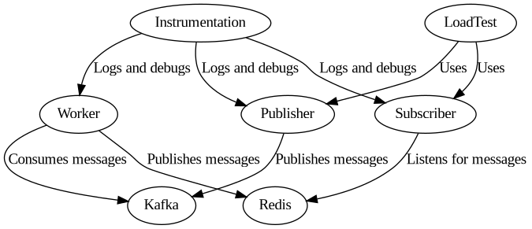
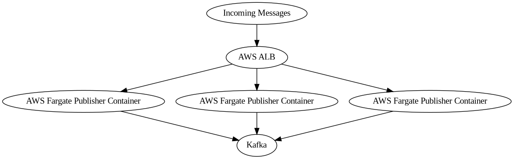

## PubSub Directory

The `pubsub` directory implements a publish-subscribe system using Kafka and Redis. It consists of the following main components:

### 1. Publisher

The publisher, defined in `publisher.ts`, is responsible for sending messages to Kafka. It utilizes the `kafkajs` library for this interaction.

### 2. Subscriber

The subscriber, defined in `subscriber.ts`, listens for messages from Redis. It uses the `ioredis` library for this interaction.

### 3. Worker

The worker, defined in `worker.ts`, consumes messages from Kafka and publishes them to Redis. It uses both `kafkajs` and `ioredis` libraries.

### 4. Load Test

A load test script (`loadtest.spec.ts`) is available to test the system's ability to handle a large number of messages. It uses the Publisher and Subscriber classes to send and receive messages.

### 5. Instrumentation

The Instrumentation class, used for logging and debugging purposes, is also part of the system.

## System Configuration

The system is designed to be scalable and can handle a large number of messages. The number of workers and the delay between messages can be configured to optimize performance.

Protocol Buffers are used for serializing structured data, with the `TagData` class serving this purpose.

Environment variables are used for system configuration. These include the addresses of the Kafka and Redis servers, among other parameters.

## Project Shasta

This system is part of a larger project called "shasta", as indicated by the `package.json` file. The project uses TypeScript and has several dependencies, including `kafkajs`, `ioredis`, and `@esfx/async-queue`.

## Testing

The system has been tested with different configurations, as indicated by the `stats.msk.cores.1.msgs.32.v*.readme.txt` files. These files contain information about the number of producers, messages per producer, workers, and delay per producer.

To mitigate the high latency issue when the number of producer connections reaches thousands, AWS Application Load Balancer (ALB) and AWS Fargate can be utilized. Here's a brief explanation of how this can be achieved:

1. AWS Fargate: Fargate, a serverless compute engine for containers, can be used to deploy your publisher application as a container. This enables easy scaling of the number of publishers without the need to manage the underlying infrastructure.

2. AWS Application Load Balancer (ALB): ALB is capable of distributing incoming traffic across multiple targets, such as Amazon EC2 instances, containers in Amazon ECS, and IP addresses. ALB can be used to distribute the incoming messages across the multiple publisher containers running in Fargate. Consequently, each publisher will manage a smaller number of connections, thereby reducing latency and enhancing reliability.

Here's a high-level diagram of the proposed architecture:

This setup provides control over the number of publisher connections by adjusting the number of containers running in Fargate. Auto-scaling rules can also be configured to automatically adjust the number of containers based on the load.

Please note that this is a high-level overview and the actual implementation may require additional components and configurations based on your specific requirements and infrastructure.

