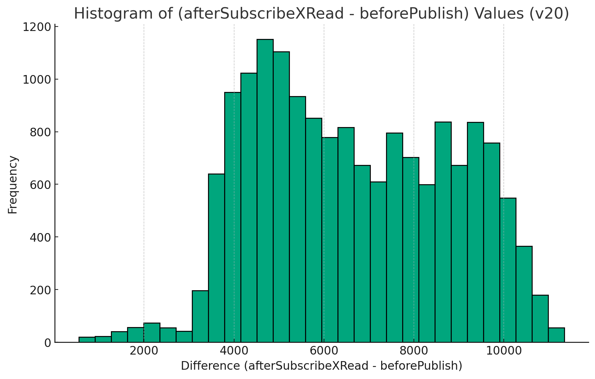
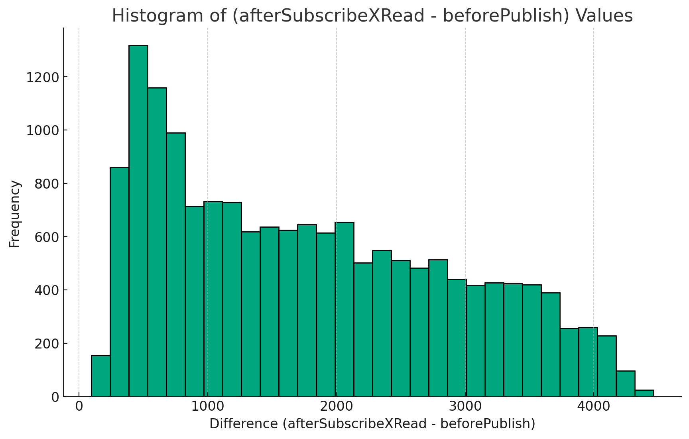

^w/o Ken's change, 1084.18 events/sec

^w Ken's change, 1627.34 events/sec

The JSON file contains the following hierarchical structure of fields:

1. Root level fields:
    - `instrumentData`

2. Fields under `instrumentData`:
    - `numCPUs`
    - `pairCount`
    - `messageCount`
    - `timestamps`

3. Fields under each entry in `timestamps`:
    - `beforePublish`
    - `afterPublish`
    - `afterConsume`
    - `afterWorkerXAdd`
    - `afterWorkerHSet`
    - `afterSubscribeXRead`

Next, I will extract and display the values for "numCPUs", "pairCount", and "messageCount". Let's proceed to step 2.

The values for the specified fields in the JSON file are as follows:

1. **numCPUs**: 1
2. **pairCount**: 512
3. **messageCount**: 32
