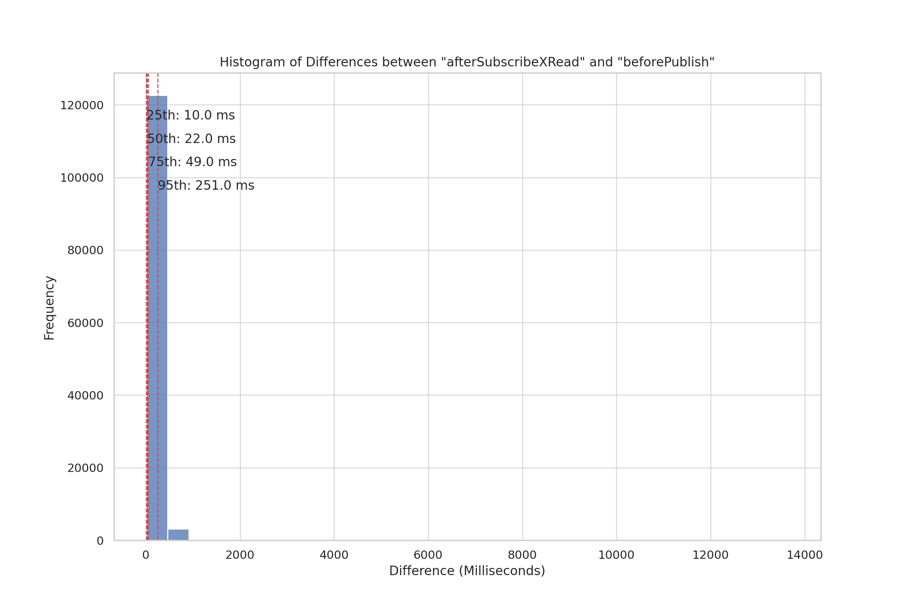
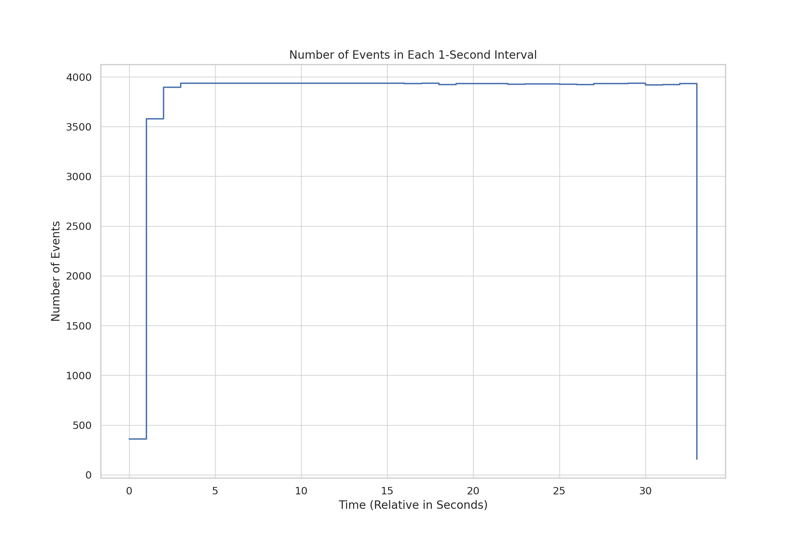

# Load Test Analysis Report

## Table of Contents
1. [Introduction](#introduction)
2. [System Configuration](#system-configuration)
3. [Data Compilation](#data-compilation)
4. [Analysis & Visualizations](#analysis--visualizations)
5. [Interpretation & Recommendations](#interpretation--recommendations)
6. [Conclusion](#conclusion)

## Introduction
This report provides an analysis of the load test conducted on a Kafka-based system. The test involved multiple nodes, each with 96 publishers, 96 subscribers, and 3 consumers.

## System Configuration
- **Load Test Nodes**: AWS EC2 `m5.large` instances
- **Kafka Brokers**: AWS EC2 `m5.4xlarge` instances
- **Kafka Topic Partitions**: 256

## Data Compilation
Data was compiled from 40 `instr*.json` files across multiple load test nodes and the original JSON file. Key metrics such as the differences between `afterSubscribeXRead` and `beforePublish`, and the number of events per second were analyzed.

## Analysis & Visualizations
### Histogram of Differences

This histogram shows the distribution of the time differences (in milliseconds) between `afterSubscribeXRead` and `beforePublish`. The red dashed lines indicate the 25th, 50th, 75th, and 95th percentiles.

### Events Per Second

This time-series plot shows the number of events processed in each 1-second interval.

## Interpretation & Recommendations
- **Resource Utilization**: Monitor CPU and memory metrics to ensure optimal performance.
- **Consumer Lag**: Keep an eye on consumer offsets to ensure that all consumers are keeping up with the messages.
- **Partition Balancing**: Ensure that partitions are evenly distributed across brokers and consumers for optimal performance.

## Conclusion
The load test revealed valuable insights into the system's performance and potential bottlenecks. Further tuning and monitoring are recommended for optimal results.
